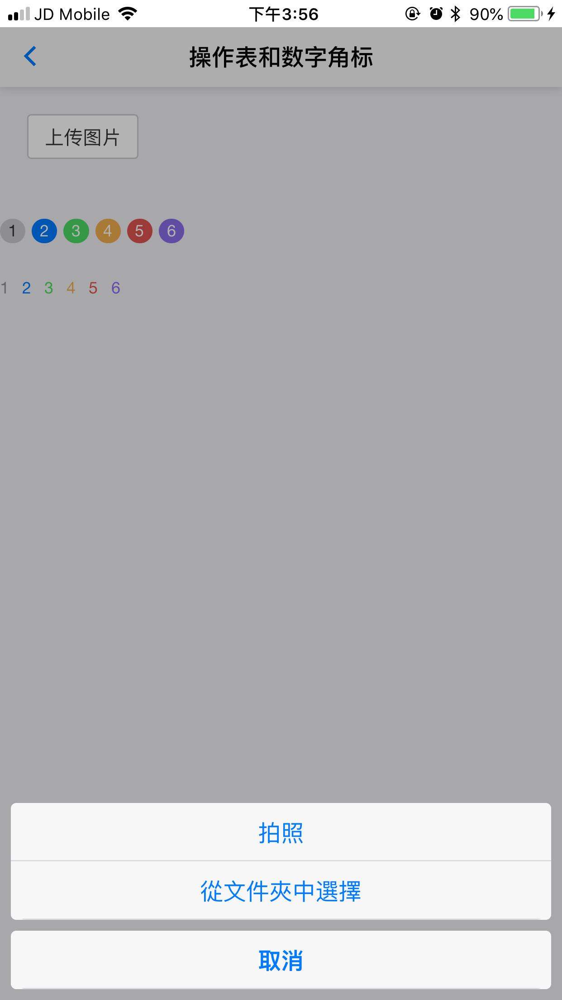
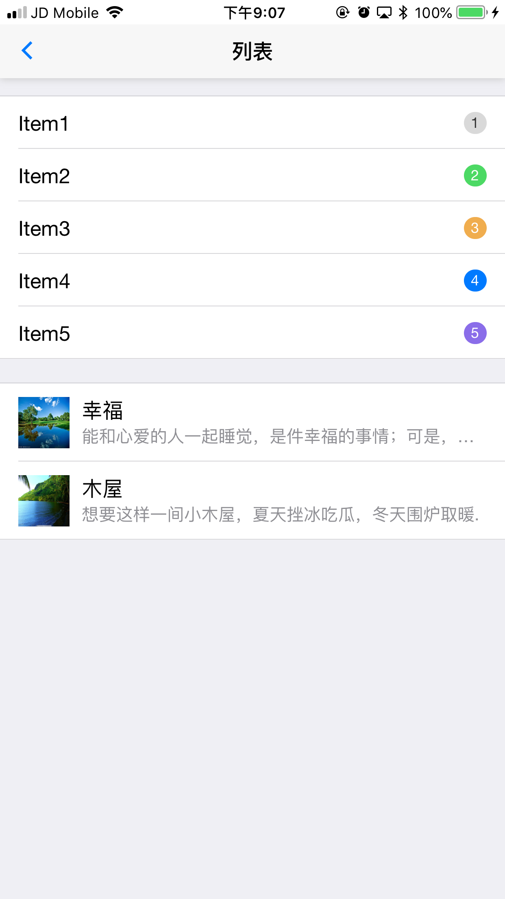
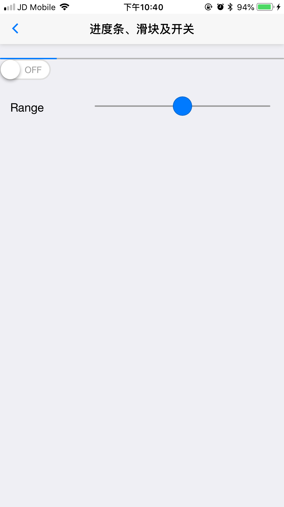
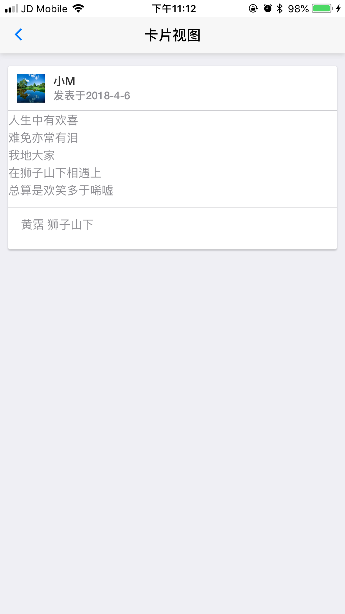

# MUI学习 demo代码

## 一、 项目创建、基础布局  
 
### 1、头部 ##
核心css  mui-bar mui-bar-nav

    <header class="mui-bar mui-bar-nav">
        
        <h1 class="mui-title">hello</h1>
    </header>

### 2、主体部分 ##
核心css mui-content

	

	    主体部分....
	

### 3、完整代码演示 ##

	<body>
	

	<header class="mui-bar mui-bar-nav">
	    
	    <h1 class="mui-title">hello</h1>
	</header>
	

	    内容部分....
	

	</body>

## 二、accordion（折叠面板）、button（按钮） ##

### 1.折叠面板 ###
折叠面板从二级列表中演化而来，dom结构和二级列表类似，如下：

	

		

			<ul class="mui-table-view">
				<li class="mui-table-view-cell mui-collapse">
					<a class="mui-navigate-right">季节</a>
					

						
春

					

					

						
夏

					

					

						
秋

					

					

						
冬

					

				</li>
				<li class="mui-table-view-cell mui-collapse mui-active">
					<a class="mui-navigate-right">节日</a>
					

						
春分

					

					

						
清明

					

					

						
秋分

					

					

						
冬至

					

				</li>
			</ul>
		

	

可以在折叠面板中放置任何内容；折叠面板默认收缩，若希望某个面板默认展开，只需要在包含.mui-collapse类的li节点上，增加.mui-active类即可；mui官网中的方法说明，使用的就是折叠面板控件  
 
**注意**：  
1、折叠面板布局必须在 mui-content下   
2、外层使用 mui-card 包裹产生边缘    

### 2.按钮 ###

	

		<button type="button" class="mui-btn">默认</button>
		<button type="button" class="mui-btn mui-btn-primary">蓝色</button>
		<button type="button" class="mui-btn mui-btn-success">绿色</button>
		<button type="button" class="mui-btn mui-btn-warning">黄色</button>
		<button type="button" class="mui-btn mui-btn-danger">红色</button>
		<button type="button" class="mui-btn mui-btn-royal">紫色</button>
	

无底色的按钮，继承自父类

	

		<button type="button" class="mui-btn mui-btn-outlined">默认</button>
		<button type="button" class="mui-btn mui-btn-primary mui-btn-outlined">蓝色</button>
		<button type="button" class="mui-btn mui-btn-success mui-btn-outlined">绿色</button>
		<button type="button" class="mui-btn mui-btn-warning mui-btn-outlined">黄色</button>
		<button type="button" class="mui-btn mui-btn-danger mui-btn-outlined">红色</button>
		<button type="button" class="mui-btn mui-btn-royal mui-btn-outlined">紫色</button>
	

### 3.效果图 ###

## 三、操作表和数字角标 ##

### 1.操作表 ###

actionsheet一般从底部弹出，显示一系列可供用户选择的操作，actionSheet是从popover控件基础上演变而来，实际上就是一个固定在底部弹出的popover，因此dom结构和popover类似，只需要在含.mui-popover类的节点上添加mui-popover-bottom、mui-popover-action类

	

		

	    	<input type="button" class="mui-btn-blue" value="上传图片" onclick="showPop();" />
	    
    
	

	

		<ul class="mui-table-view">
		  <li class="mui-table-view-cell">
		    <a href="#">拍照</a>
		  </li>
		  <li class="mui-table-view-cell">
		    <a href="#">從文件夾中選擇</a>
		  </li>
		</ul>
		<ul class="mui-table-view">
		  <li class="mui-table-view-cell">
		    <a href="#sheet1"><b>取消</b></a>
		  </li>
		</ul>
	

	

### 2.数字角标 ###

数 字角标一般和其它控件（列表、9宫格、选项卡等）配合使用，用于进行数量提示。 角标的核心类是.mui-badge，默认为实心灰色背景；同时，mui还内置了蓝色（blue）、绿色(green)、黄色(yellow)、红色 (red)、紫色(purple)五种色系的数字角标

	

		1
		2
		3
		4
		5
		6
	

如果不需要底色，则添加类mui-badge-inverted

	

		1
		2
		3
		4
		5
		6
	

### 3.效果图 ###

## 四、获取单选框和复选框的值 ##

### 1.获取复选框的值 ###

	

		<label for="">英语</label>
		<input type="checkbox" value="English" name="language" />
	

	

		<label for="">法语</label>
		<input type="checkbox" value="Franch" name="language" />
	

	

		<label for="">日语</label>
		<input type="checkbox" value="Japanese" name="language" />
	

	<button id="button" onclick="getCheckBoxValue()">获取复选框的值</button>

 js代码如下

	function getCheckBoxValue(){
		var ck=document.getElementsByName('language')
		var checkVal=[];
		for(i=0;i<ck.length;i++){
			if(ck[i].checked){
				checkVal.push(ck[i].value);
			}
		}
		mui.toast(checkVal);
	}

### 2.获取单选框的值 ###

	

		<label for="">星期一</label>
		<input type="radio" name="weeks" value="Mon"/>
	

	

		<label for="">星期二</label>
		<input type="radio" name="weeks" value="Tue"/>
	

	

		<label for="">星期日</label>
		<input type="radio" name="weeks" value="Sun"/>
	

	<button class="mui-btn mui-btn-success" onclick="getRadioValue()" >获取单选框的值</button>

js代码如下

	function getRadioValue(){
		var radio=document.getElementsByName('weeks');
		var checkVal=null;
		for(i=0;i<radio.length;i++){
			if(radio[i].checked){
				checkVal=radio[i].value;
			}
		}
		mui.toast(checkVal);
	}

3.列表式单选控件

	

		<ul class="mui-table-view mui-table-view-radio">
			<li class="mui-table-view-cell">
				<a class="mui-navigate-right">1</a>
			</li>
			<li class="mui-table-view-cell">
				<a class="mui-navigate-right">2</a>
			</li>
			<li class="mui-table-view-cell">
				<a class="mui-navigate-right">3</a>
			</li>
		</ul>
	

js代码如下

	var list=document.querySelector('.mui-table-view-radio');
	list.addEventListener('selected',function(e){
		mui.toast("当前选中的为"+e.detail.el.innerText);
	});

### 4.效果图 ###

  

  

  

## 五、时间选择器 ##

### 1.选择日期 ###

	

		

	        <button id='pickDateBtn' type="button" class="mui-btn">选择日期</button>
	    

	    

	        <button id='pickTimeBtn' type="button" class="mui-btn">选择时间</button>
	    

	

js代码

	document.getElementById('pickDateBtn').addEventListener('tap',function(){
		var dDate=new Date();
		//设置当前日期 不设置默认为今日日期
		dDate.setFullYear(2017,1,1);
		var minDate=new Date();
		minDate.setFullYear(2010,0,1);
		var maxDate=new Date();
		maxDate.setFullYear(2019,11,31);
		plus.nativeUI.pickDate(function(e){
			var d=e.date;
			mui.toast("您选择的日期是"+d.getFullYear()+"年"+(d.getMonth()+1)+"月"+d.getDate()+"日");
		},function(e){
			mui.toast('您没有选择日期');
		},{
			title:'请选择日期',
			date:dDate,
			minDate:minDate,
			maxDate:maxDate
		});
	});
	document.getElementById('pickTimeBtn').addEventListener('tap',function(){
		var dTime=new Date();
		dTime.setHours(6,1);
		plus.nativeUI.pickTime(function(e){
			var d =e.date;
			mui.toast("您选择的时间是："+d.getHours()+":"+d.getMinutes());
		},function(){
			mui.toast('您没有选择时间');
		},{
			title:'请选择时间',
			is24Hour:true,
			time:dTime
		});
	});

### 2.效果图 ###

  

## 六、对话框和表单 ##

### 1.mui.alert()普通提醒 ###

参数

	message     Type:string 提示框上显示的内容
	title       Type:string 提示框显示的标题
	btnValue    Type:string 提示框按钮的内容
    callback    Type:Function 提示框关闭后的回调函数
    type        Value:'div' 是否使用h5绘制的对话框

代码

	mui.alert('欢迎使用mui','Hello','yes',function(){
		mui.toast('您刚关闭了警告框');
	});

### 2.mui.confirm()消息提示框 ###

参数

	message     Type:string 提示框上显示的内容
	title       Type:string 提示框显示的标题
	btnValue    Type:string 提示框按钮的内容
    callback    Type:Function 提示框关闭后的回调函数
    type        Value:'div' 是否使用h5绘制的对话框

代码

	var btnArray = ['取消', '确定'];
	mui.confirm('真的要删除吗？','Hi...',new Arr('否','是'),funct({
	   if(e.index == 1){mui.toast('是');}else{mui.toast('否');}
	});

### 3.mui.prompt（）输入框 ###

参数

	message       Type: String 提示对话框上显示的内容
	placeholder   Type: String 编辑框显示的提示文字
	title         Type: String 提示对话框上显示的标题
	btnValue      Type: Array 提示对话框上按钮显示的内容
	callback      Type: Function提示对话框上关闭后的回调函数
	type         Value: 'div' 是否使用h5绘制的对话框

代码

	var btnArray=['取消','确定'];
	mui.prompt('请输入您的姓名','Hi...',new Array('取消','确定'),function(e){
		if(e.index==1){
			mui.toast(e.value);
		}else{
			mui.toast('您取消了输入');
		}
	});

### 4.表单元素 ###

所有包含在mui-input-row类中的input，textarea等元素都将被默认设置宽度属性为100%，将label元素和上述控件包裹在mui-input-group中可获得最好的排列

	<form class="mui-input-group">
		

			<label for="">用户名</label>
			<input type="text" class="mui-input-clear" name="username" id="" value="" placeholder="请输入用户名"/>
		

		

			<label for="">密码</label>
			<input type="password" class="mui-input-password" placeholder="请输入密码" />
		

		

			<input type="search" class="mui-input-clear" placeholder="搜索" />
		

		

			<button type="button" class="mui-btn mui-btn-primary">提交</button>
			<button type="button" class="mui-btn mui-btn-danger">取消</button>
		

	</form>

### 5.效果图 ###

## 七、轮播组件 ##

### 1.轮播组件 ###

轮播组件是mui提供的一个核心组件，在该核心组件的基础上，衍生除了图片轮播，可拖动式图文表格，可拖动式选项卡，左右滑动9宫格组件等。

示例代码

	

		

			

				<!--循环轮播-->
				

					
				

				

				

				

				

				

					
				

			

			<!--添加小圆点-->
			

				

				

			

		

	

js代码

	

### 2.效果图 ###

## 八、列表 ##

### 1.普通列表 ###

	<ul class="mui-table-view">
		<li class="mui-table-view-cell">Item1 1</li>
		<li class="mui-table-view-cell">Item2 2</li>
		<li class="mui-table-view-cell">Item3 3</li>
		<li class="mui-table-view-cell">Item4 4</li>
		<li class="mui-table-view-cell">Item5 5</li>
	</ul>

### 2.图文列表 ###

	<ul class="mui-table-view">
		<li class="mui-table-view-cell mui-media">
			
			
			

				幸福
				
能和心爱的人一起睡觉，是件幸福的事情；可是，打呼噜怎么办？

			

		</li>
		<li class="mui-table-view-cell mui-media">
			
			
			

				木屋
				
想要这样一间小木屋，夏天挫冰吃瓜，冬天围炉取暖.

			

		</li>
	</ul>

### 3.效果图 ###

## 九、进度条、滑块及开关 ##

### 1.进度条 ###

	

	    
	

初始化

	mui('#demo1').progressbar({progress:20}).show();

progressbar初始化逻辑：  

检查当前容器(container控件)自身是否包含.mui-progressbar类：   

当前容器包含.mui-progressbar类，则以当前容器为目标控件，直接显示进度；   

否则，检查当前容器的直接孩子节点是否包含.mui-progressbar类，若存在，则以遍历到的第一个含有.mui-progressbar类的孩子节点为目标控件，显示进度；    

若当前容器的直接孩子节点，均不含.mui-progressbar类,则自动创建进度条控件；    

更改显示进度条: 

	mui(container).progressbar().setProgress(50);

关闭进度条

	mui(container).progressbar().hide();

备注：关闭进度条一般用于动态创建（DOM中预先未定义）的进度条，调用hide方法后，会直接删掉对应的DOM节点；若已提前创建好DOM节点的进度条，调用hide方法无效；

### 2.滑块 ###

	

		<label for="">Range</label>
		<input type="range" name="" id="" min="0" max="100"/>
	

### 3.switch开关 ###

	

		

	

默认打开状态 只需要在mui-switch节点上添加类 mui-active     

简洁模式  需要在mui-switch节点上添加类 mui-switch-mini     

蓝色开关控件  需要在mui-switch节点上添加类mui-switch-blue   

开关的事件监听

	document.getElementById("mySwitch").addEventListener("toggle",function(event){
	    if(event.detail.isActive){
	        mui.toast("你启动了开关");
		}else{
		    mui.toast("你关闭了开关");  
		}
	});

### 4.效果图 ###

## 十、卡片视图 ##

### 1.卡片视图 ###

	

		

			
			

				小M
				
发表于2018-4-6

			

		

		

			

				人生中有欢喜  
				难免亦常有泪  
				我地大家 
				在狮子山下相遇上 
				总算是欢笑多于唏嘘 
			

		

		

			
黄霑    狮子山下

		

	

### 2.蒙版 ###

在popover、侧滑菜单等界面，经常会用到蒙版遮罩；比如popover弹出后，除popover控件外的其它区域都会遮罩一层蒙版，用户点击蒙版不会触发蒙版下方的逻辑，而会关闭popover同时关闭蒙版；再比如侧滑菜单界面，菜单划出后，除侧滑菜单之外的其它区域都会遮罩一层蒙版，用户点击蒙版会关闭侧滑菜单同时关闭蒙版。   

遮罩蒙版常用的操作包括：创建、显示、关闭，如下代码：  

	var mask = mui.createMask(callback);//callback为用户点击蒙版时自动执行的回调；
	mask.show();//显示遮罩
	mask.close();//关闭遮罩

注意：关闭遮罩仅会关闭，不会销毁；关闭之后可以再次调用mask.show();打开遮罩；     
mui默认的蒙版遮罩使用.mui-backdrop类定义（如下代码），若需自定义遮罩效果，只需覆盖定义.mui-backdrop即可；    

	.mui-backdrop {position: fixed;top: 0;right: 0;bottom: 0;left: 0;z-index: 998;background-color: rgba(0,0,0,.3);}

### 3.样式 ###

